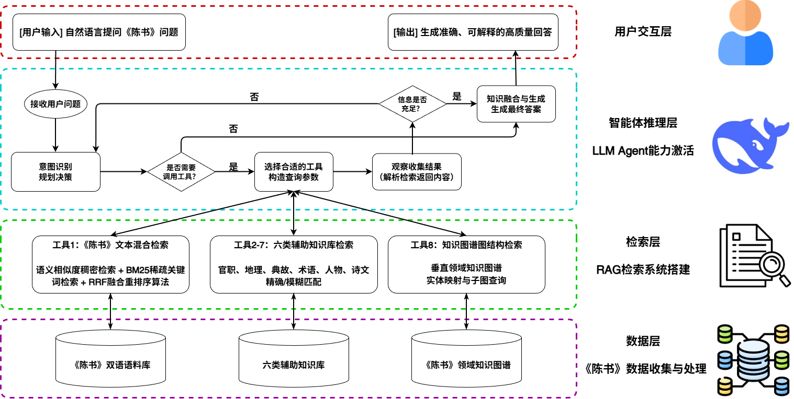
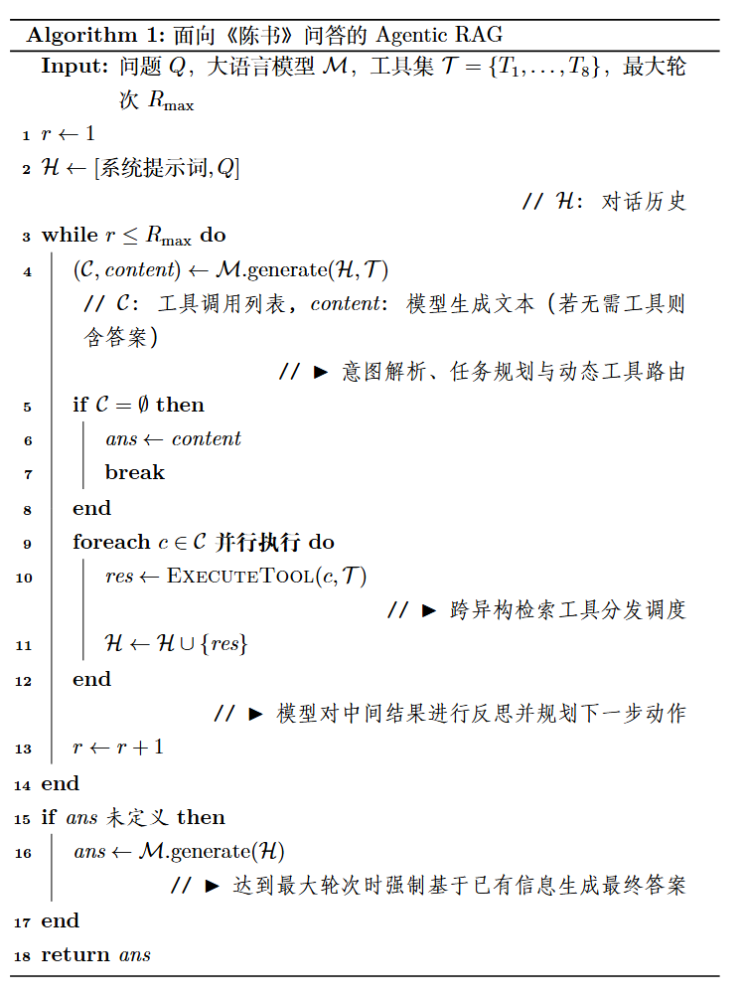

# ShijiQA Agent

ShijiQA Agent 是一个面向《陈书》及南朝历史知识问答的 Agentic RAG 系统。项目采用前后端分离的 B/S 架构：前端使用 React、TypeScript 与 Vite 构建浏览器端问答界面，后端使用 FastAPI、SQLAlchemy 与 SSE 承担用户认证、会话存储、模型调用和工具编排。系统围绕史籍文本“信息分散、表达古今差异大、人物制度关系复杂”的特点，将文白双语语料、辅助知识库和领域知识图谱组织为可被大模型调用的检索工具，并在浏览器中展示从工具选择、检索返回到答案生成的完整过程。

系统的核心思路来自论文《面向〈陈书〉的 Agentic RAG 史籍知识问答研究》：数据层负责组织《陈书》原文、现代译文、人物、诗文、官职、地理、事件、术语和知识图谱；检索层根据不同数据形态使用稀疏检索、稠密向量检索、精确匹配和图结构检索；Agent 推理层则以 FastAPI 后端中的工具调度服务承载 ReAct 范式，配合 React 前端完成“思考、行动、观察、再行动、最终回答”的可视化闭环。

## 系统结构

系统整体结构如下图所示。该架构将浏览器端交互、FastAPI 后端 Agent 编排、RAG 检索系统构建和底层史籍数据组织在同一条问答链路中，体现了前端会话体验、后端工具调度与多类型数据检索之间的协作关系。



前端 `wenyuan-web` 基于 React Router 管理介绍页、登录注册页和问答页，使用 TypeScript 类型约束接口数据，并通过 fetch 读取后端 SSE 流。后端 `wenyuan-api` 基于 FastAPI 暴露 REST/SSE 接口，使用 SQLAlchemy 管理用户、会话、消息、Agent 运行记录和检索证据。前端负责注册登录、会话历史、模型切换、消息流式展示和过程折叠；后端负责用户认证、会话存储、模型调用、工具执行、检索证据保存和过程回放。

## 数据组织

论文中的数据体系分为三层。后端通过服务层将这些数据源封装为工具接口，前端则把工具调用和返回结果按消息内过程块展示：

| 数据类型 | 数据规模 | 数据格式 | 主要字段 |
| --- | ---: | --- | --- |
| 《陈书》古文原文及现代译文 | 36 卷 / 848 段 / 394968 字 | TXT | 原文段落、译文段落 |
| 文白平行语料 | 8214 句 | JSON | 原文、译文、实体列表 |
| 人物知识库 | 505 条 | JSON | 姓名、所属朝代、人物介绍 |
| 诗文知识库 | 851 条 | JSON | 作者、诗名、诗句、韵律 |
| 地理数据库 | 712 条 | CSV | 地名、地理描述 |
| 官职知识库 | 1537 条 | CSV | 官职名称、品级、上下属、职能描述 |
| 典故事件知识库 | 1142 条 | CSV | 典故事件名称、典故事件描述 |
| 术语句法知识库 | 11959 条 | CSV | 术语词、现代释义 |

这些数据源的分工不同：双语语料用于连接古文原文与现代语义，辅助知识库用于补充人物、制度、地理和语言学细节，知识图谱用于表达人物、官职、地名之间的结构化关系。

## 八类检索工具

| 工具 | 检索方法 | 输入 | 输出 | 用途 |
| --- | --- | --- | --- | --- |
| `search_bilingual` | 稠密向量检索 + BM25 稀疏检索，使用 RRF 融合排序 | 现代汉语句子或完整文本片段 | 文件名、篇目标题、现代文译文、古文原文 | 定位《陈书》相关段落，建立现代问题与古文依据之间的对应关系 |
| `search_person` | 人名别名映射 + JSON 精确匹配 | 人物姓名、庙号、谥号或常见别称 | 人物档案、生平字段、家族关系、主要事迹 | 查询人物身份、生平、官职、别名和关系背景 |
| `search_poetry` | 作者规范名匹配 + 标题包含匹配 | 作者名、诗题关键词，至少一个 | 作者、题名、正文、朝代、备注 | 查询南朝诗文作品及其作者信息 |
| `search_official_positions` | 官职名精确匹配；未命中时进行稠密向量语义检索并按距离分组 | 准确官职名称 | 官职名称、品阶、职责、沿革 | 查询官制、品级、上下属和职能描述 |
| `search_geography` | 地名精确匹配；未命中时进行稠密向量语义检索并按距离分组 | 古代地名或地理关键词 | 标题、地理内容、沿革说明 | 查询都城、州郡、地名沿革和对应地域 |
| `search_historical_events` | 事件名精确匹配；未命中时进行稠密向量语义检索并按距离分组 | 事件名或典故关键词 | 事件背景、经过、例子 | 查询战争、政变、叛乱、典故和历史事件 |
| `search_terminology` | 术语精确匹配；未命中时进行稠密向量语义检索并按距离分组 | 古籍术语、制度词、句法词 | 术语词、现代释义 | 解释文言术语、礼制词和句法表达 |
| `search_knowledge_graph` | 实体映射优先；未命中时进行向量近邻实体检索，再返回三元组 | 人物、官职、地名等实体名称 | 实体名称及相关三元组 | 支持人物关系、官职隶属、地理归属和多跳链式推理 |

检索模块对应代码位于 `research_code/retrieval/`，后端通过 `wenyuan-api/app/services/prepared_retrieval.py` 适配这些检索接口。数据预处理、向量库构建和 BM25 索引构建脚本位于 `research_code/preprocessing/`。前端不会直接访问检索脚本，而是通过后端 SSE 接收结构化后的过程块和证据块。

## Agentic 工作流

系统不是固定执行“先检索再回答”的线性流程，而是由 FastAPI 后端把 8 个检索模块注册为模型工具，再由大模型根据问题动态选择。React 前端在同一条助手消息中展示每一步状态：

1. 用户提出问题，系统将当前会话上下文传入模型。
2. 模型判断是否需要检索，以及应调用哪些工具。
3. 后端执行工具调用，返回观察结果。
4. 模型阅读观察结果，判断信息是否充分。
5. 若仍缺少证据，模型继续发起下一轮工具调用。
6. 达到足够证据后，模型整合检索结果生成最终答案。

论文中的 Agentic RAG 工作流伪代码如下：



在工程实现中，React 前端将伪代码中的任务规划、工具调用、工具返回结果和最终答案组织为同一条助手消息内的可折叠过程块；FastAPI 后端负责执行工具分发、记录每轮 Agent 过程并将 SSE 事件推送给前端。这样既保留论文中的 Agentic RAG 运行逻辑，也便于浏览器端回放每轮问答的检索依据和生成过程。

## 代码目录

```text
github-ShijiQA-Agent/
  wenyuan-api/                 # FastAPI 后端：认证、会话、SSE、Agent 编排、工具调用
  wenyuan-web/                 # React + TypeScript 前端：登录注册、聊天页面、过程可视化
  research_code/
    retrieval/                 # 8 类数据库检索脚本
    preprocessing/             # 向量生成、ChromaDB 构建、BM25 构建脚本
    experiments/               # Agent 实验和多模型评测脚本，已脱敏
  docs/                        # 需求、架构、设计、配置、验收与数据说明
  scripts/                     # 启动和冒烟测试脚本
  dev-logs/                    # 开发日志
```

## 本地运行

后端使用 FastAPI 启动 API 服务，默认本地地址为 `http://127.0.0.1:8000`：

```powershell
cd github-ShijiQA-Agent
.\.venv\Scripts\python.exe -m pip install -r .\wenyuan-api\requirements.txt
.\scripts\start_backend.ps1
```

前端使用 Vite 启动浏览器开发服务，默认本地地址为 `http://127.0.0.1:5173`：

```powershell
cd github-ShijiQA-Agent\wenyuan-web
npm install
npm run dev
```

浏览器访问：

```text
http://127.0.0.1:5173
```

## 模型配置

后端支持 OpenAI-compatible `/chat/completions`。前端只负责选择模型名称，实际 API Key、base_url 和模型 ID 均由后端本机配置读取。可在 `wenyuan-api/.env.local` 中配置：

```text
LLM_PROVIDER=deepseek
LLM_BASE_URL=https://api.deepseek.com
LLM_MODEL=deepseek-v4-pro
LLM_API_KEY=your_api_key
```

多模型本机配置方式见 `docs/07_llm_configuration.md`。

## 验证

```powershell
.\scripts\smoke_test.ps1
```

该脚本会检查后端导入、8 个预置检索工具、注册登录、会话创建、SSE 问答、过程记录、会话删除和前端构建。(同时覆盖 FastAPI 后端链路和 React 前端构建)

## 数据说明

本项目暂未开源真实数据集、真实 ChromaDB 向量库和 BM25 索引文件。仓库中保留的是 React 前端、FastAPI 后端、检索接口、预处理脚本、实验脚本和用于演示接口流程的预置数据适配器。这样做是为了在不公开原始数据的情况下，仍然保持 Web 系统、Agent 工具调用协议和检索流程可以本地运行与检查。
